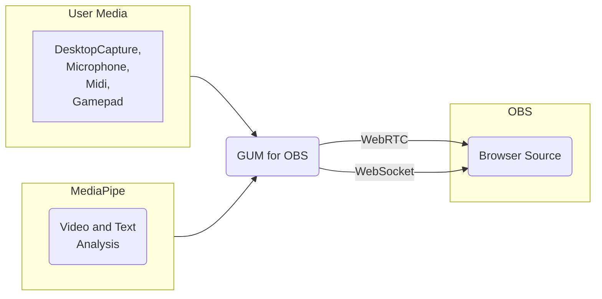

# Get User Media(GUM) for OBS

<!-- ToC begin -->

- [Get User Media(GUM) for OBS](#get-user-mediagum-for-obs)
  - [Getting Started](#getting-started)
    - [Enable the OBS WebSocket Server](#enable-the-obs-websocket-server)
    - [Connect to the OBS WebSocket Server](#connect-to-the-obs-websocket-server)
    - [Capture Audio or Desktop](#capture-audio-or-desktop)
      - [Add an OBS Scene and Sourced](#add-an-obs-scene-and-sourced)
<!-- Generated by gh-toc, https://moonbase59.github.io/gh-toc/ -->
<!-- ToC end -->

The OBS Browser Source doesn't support direct access to media like Camera, Microphone, Desktop Capture, Midi and Game Controllers. 
The Get User Media for OBS sends media from a Chrome Browser to the OBS Browser source. 

## Getting Started
Open [GUM for OBS](https://obsgum.github.io/) in a Chrome browser.  
Optionally, download and run GUM for OBS locally.  
> :memo: **Note:** The WebSpeech API doesn't work locally.  Google annouced at I/O 2024 that local WebSpeech is coming soon. 

### Enable the OBS WebSocket Server
Open [OBS](https://obsproject.com/).
1. In the menu bar click Tools --> WebSocket Server Settings
2. Check the box to "Enable WebSocket Server"
3. Click the "Show Connect Info" button
4. copy the password

### Connect to the OBS WebSocket Server

On the GUM for OBS page enter the OBS WebSocket Server details in the IP address, Port Number and Password fields. 
Click the "Connect to OBS" button.  If the connection is successful the button color will turn to green. 

### Capture Audio or Desktop
- To capture a desktop window, check the "Desktop Window" box. [how to create an OBS projector window](#add-an-obs-scene-and-source)
- To capture a desktop window, check the "Desktop Window" box. [how to create an OBS projector window](#getting-started)
- To capture a microphone, check the "Microphone" box. 

#### Add an OBS Scene and Sourced
1. Create a Scene named "Scene"
2. Add a Video Capture Device source

3.Open a preview window
  - right click on the "Video Capture Device" source
  - click "Windowed Projector (Source)"
  - 

