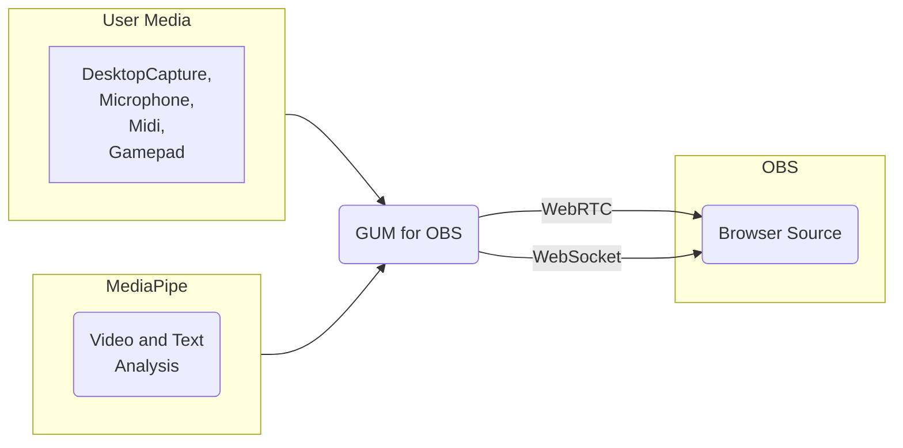

# Get User Media(GUM) for OBS

<!-- ToC begin -->

- [Getting Started](#getting-started)
- [WebRTC Audio Video](#-webrtc-audio-video)
- [Audio Frequency Analysis](#audio-frequency-analysis)
- [Speech Recognition](#speech-recognition)
- [MIDI Input](#midi-input)
- [Gamepad Input](#gamepad-input)
- [MediaPipe Pose Landmarks](#-mediapipe-pose-landmarks)
- [MediaPipe Hand Landmarks](#-mediapipe-hand-landmarks)
- [MediaPipe Face Landmarks](#-mediapipe-face-landmarks)
- [MediaPipe Image Segmentation](#-mediapipe-image-segmentation)
- [MediaPipe Text Sentiment](#-mediapipe-text-sentiment)
- [MediaPipe Gemma LLM Inference](#-mediapipe-gemma-llm-inference)

<!-- ToC end -->

The OBS Browser Source doesn't support direct access to media like Camera, Microphone, Desktop Capture, Midi and Game Controllers. 
The Get User Media for OBS sends media from a Chrome Browser to the OBS Browser source. 


## <a id="getting-started"></a>Getting Started
Open [GUM for OBS](https://obsgum.github.io/) in a Chrome browser.  
Optionally, download and run GUM for OBS locally.  
> :memo: **Note:** The WebSpeech API doesn't work locally.  Google annouced at I/O 2024 that local WebSpeech is coming soon. 

### Enable the OBS WebSocket Server
Open [OBS](https://obsproject.com/).
1. In the menu bar click Tools --> WebSocket Server Settings
2. Check the box to "Enable WebSocket Server"
3. Click the "Show Connect Info" button
4. copy the password

### Connect to the OBS WebSocket Server
<p></p>
On the GUM for OBS page enter the OBS WebSocket Server details in the IP address, Port Number and Password fields. 
Click the "Connect to OBS" button.  If the connection is successful the button color will turn to green. 

### Capture Audio or Desktop
- To capture a desktop window, check the "Desktop Window" box. [how to create an OBS projector window](#add-an-obs-scene-and-source)
- To capture a microphone, check the "Microphone" box. 
> :memo: **Note:** Choosing a window or microphone to capture is optional, if you are only using Midi and Gamepad inputs.  

#### <a id="add-an-obs-scene-and-source"></a>Add an OBS Scene and Sourced
1. Create a Scene named "Scene"
2. Add a Video Capture Device source


3. Open a preview window
  - right click on the "Video Capture Device" source
  - click "Windowed Projector (Source)"
  - 

## Audio Frequency Analysis
The audio data from the selected microphone is sent to OBS as a browser event message. 
By default messages are sent 1 per second.  The frames per second can be set to a preferred speed.
### Audio Frequency Message
**Message name:** audio-input

**Event listener example**
```javascript
window.addEventListener("audio-input", function (event) {
    console.log("audio received: ",event)
    document.getElementById("audioFFT").innerText = JSON.stringify(event.detail);
  });
```

**Event data**

Audio is processed into 128 key value pairs.  
Object 
```JSON
{
    "dataArray": {
        "0": 177,
        "1": 179,
        ...
        "127": 0
    }
}
```

## MIDI Input
The MIDI data from detected devices is sent to OBS as a browser event message. 
The webMIDI.js library is used to process the MIDI devices and messages. 

### MIDI Output Message
**Message name:** midi-message

**Event listener example**
```javascript
window.addEventListener("midi-message", function (event) {
    //console.log("midi received: ",event)
    document.getElementById("midiMessage").innerText = JSON.stringify(
      event.detail
    );
  });
```

**Event data**
The MIDI event message includes the "deviceName" and "midiEvent" details.  
 
Object 
```JSON
{
    "deviceName": "iPad",
    "midiEvent": "{\"rawData\":{\"0\":144,\"1\":62,\"2\":0},\"data\":[144,62,0],\"statusByte\":144,\"rawDataBytes\":{\"0\":62,\"1\":0},\"dataBytes\":[62,0],\"isChannelMessage\":true,\"isSystemMessage\":false,\"command\":9,\"channel\":1,\"type\":\"noteon\"}"
}
```
## Gamepad Input
The Gamepad data from detected devices is sent to OBS as a browser event message. 

### Gamepad Output Message
**Message name:** gamepad-message

**Event listener example**
```javascript
  window.addEventListener("gamepad-message", function (event) {
    console.log("gamepad-message received: ",event)
    document.getElementById("gamepad-message").innerText = JSON.stringify(
      event.detail
    );
  });
```

**Event data**
The Gamepad event message details are sent as string.  
 
Object 
```JSON
{
    "gamepadEvent": "{\n  \"index\": 0,\n  \"id\": \"8BitDo Micro gamepad (Vendor: 2dc8 Product: 9020)\",\n  \"mapping\": \"\",\n  \"axes\": [\n    -0.003921568393707275,\n    -0.003921568393707275,\n    -0.003921568393707275,\n    0,\n    -1,\n    -0.003921568393707275,\n    0,\n    0,\n    0,\n    1.2857143878936768\n  ],\n  \"buttons\": [\n    {\n      \"pressed\": false,\n      \"touched\": false,\n      \"value\": 0\n    },\n    {\n      \"pressed\": false,\n      \"touched\": false,\n      \"value\": 0\n    },\n    {\n      \"pressed\": false,\n      \"touched\": false,\n      \"value\": 0\n    },\n    {\n      \"pressed\": false,\n      \"touched\": false,\n      \"value\": 0\n    },\n    {\n      \"pressed\": false,\n      \"touched\": false,\n      \"value\": 0\n    },\n    {\n      \"pressed\": false,\n      \"touched\": false,\n      \"value\": 0\n    },\n    {\n      \"pressed\": false,\n      \"touched\": false,\n      \"value\": 0\n    },\n    {\n      \"pressed\": false,\n      \"touched\": false,\n      \"value\": 0\n    },\n    {\n      \"pressed\": false,\n      \"touched\": false,\n      \"value\": 0\n    },\n    {\n      \"pressed\": false,\n      \"touched\": false,\n      \"value\": 0\n    },\n    {\n      \"pressed\": false,\n      \"touched\": false,\n      \"value\": 0\n    },\n    {\n      \"pressed\": false,\n      \"touched\": false,\n      \"value\": 0\n    },\n    {\n      \"pressed\": false,\n      \"touched\": false,\n      \"value\": 0\n    },\n    {\n      \"pressed\": false,\n      \"touched\": false,\n      \"value\": 0\n    },\n    {\n      \"pressed\": false,\n      \"touched\": false,\n      \"value\": 0\n    },\n    {\n      \"pressed\": false,\n      \"touched\": false,\n      \"value\": 0\n    }\n  ],\n  \"vibrationActuator\": null\n}"
}
```
 
 ##  MediaPipe Pose Landmarks

###  Output Message
**Message name:** 
**Event listener example**
```javascript
window.addEventListener("message", function (event) {
    //Do Something
  });
```

**Event data**
 
Object 
```JSON
{

}
```

##  MediaPipe Hand Landmarks

###  Output Message
**Message name:** 
**Event listener example**
```javascript
window.addEventListener("message", function (event) {
    //Do Something
  });
```

**Event data**
 
Object 
```JSON
{

}
```

##  MediaPipe Face Landmarks

###  Output Message
**Message name:** 
**Event listener example**
```javascript
window.addEventListener("message", function (event) {
    //Do Something
  });
```

**Event data**
 
Object 
```JSON
{

}
```

##  MediaPipe Image Segmentation

###  Output Message
**Message name:** 
**Event listener example**
```javascript
window.addEventListener("message", function (event) {
    //Do Something
  });
```

**Event data**
 
Object 
```JSON
{

}
```

##  MediaPipe Text Sentiment

###  Output Message
**Message name:** 
**Event listener example**
```javascript
window.addEventListener("message", function (event) {
    //Do Something
  });
```

**Event data**
 
Object 
```JSON
{

}
```

##  MediaPipe Gemma LLM Inference

###  Output Message
**Message name:** 
**Event listener example**
```javascript
window.addEventListener("message", function (event) {
    //Do Something
  });
```

**Event data**
 
Object 
```JSON
{

}
```

##  WebRTC Audio Video

###  Output Message
**Message name:** 
**Event listener example**
```javascript
window.addEventListener("message", function (event) {
    //Do Something
  });
```

**Event data**
 
Object 
```JSON
{

}
```

## Speech Recognition

###  Output Message
**Message name:** 
**Event listener example**
```javascript
window.addEventListener("message", function (event) {
    //Do Something
  });
```

**Event data**
 
Object 
```JSON
{

}
```


<!-- ##  Input

###  Output Message
**Message name:** 
**Event listener example**
```javascript
window.addEventListener("message", function (event) {
    //Do Something
  });
```

**Event data**
 
Object 
```JSON
{

}
``` -->